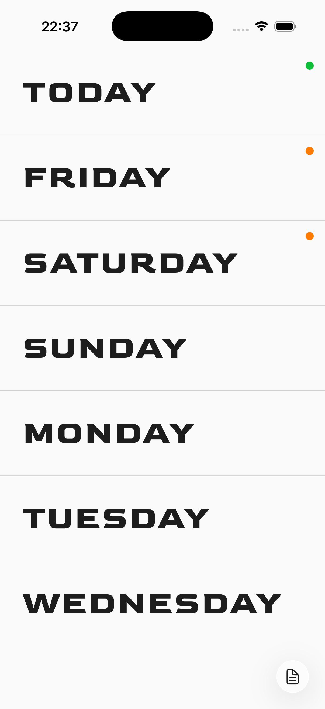
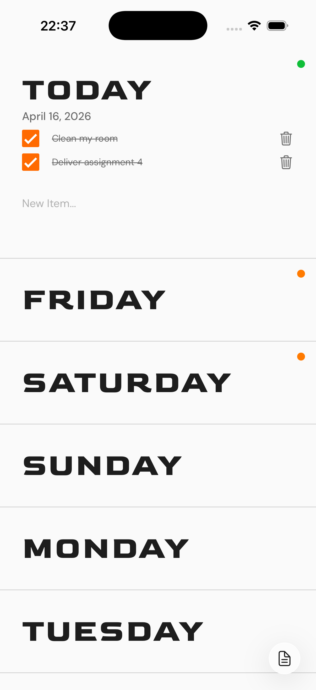
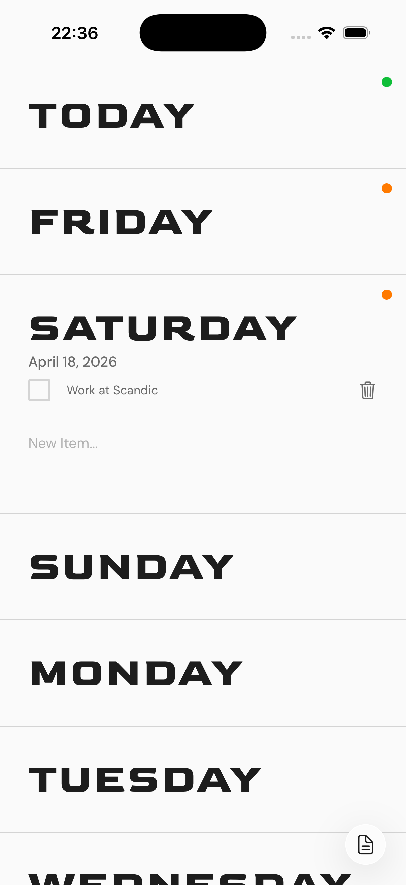
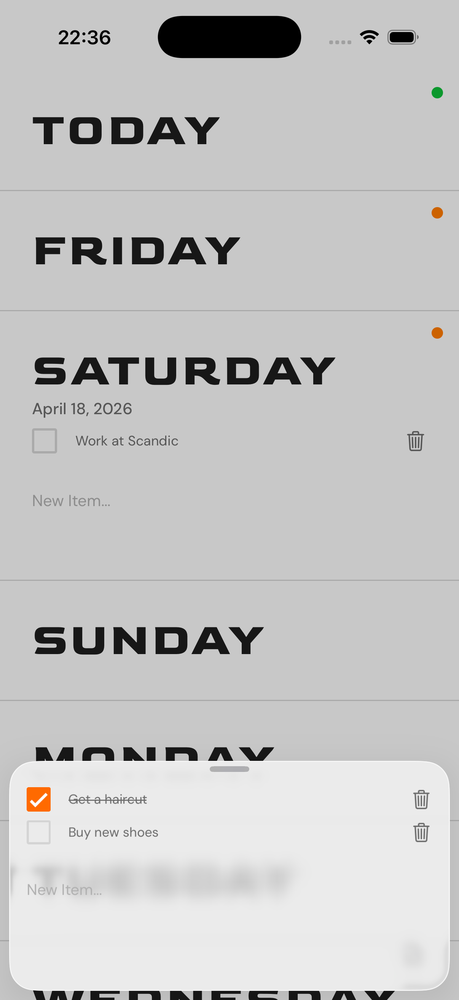
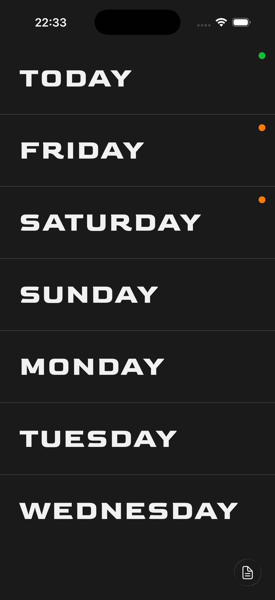
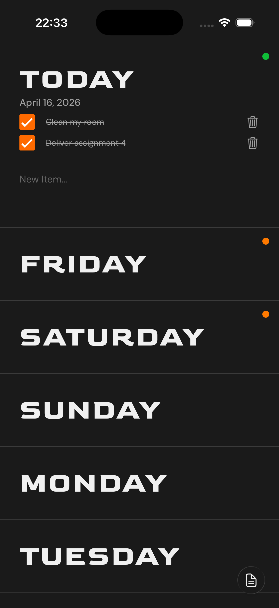
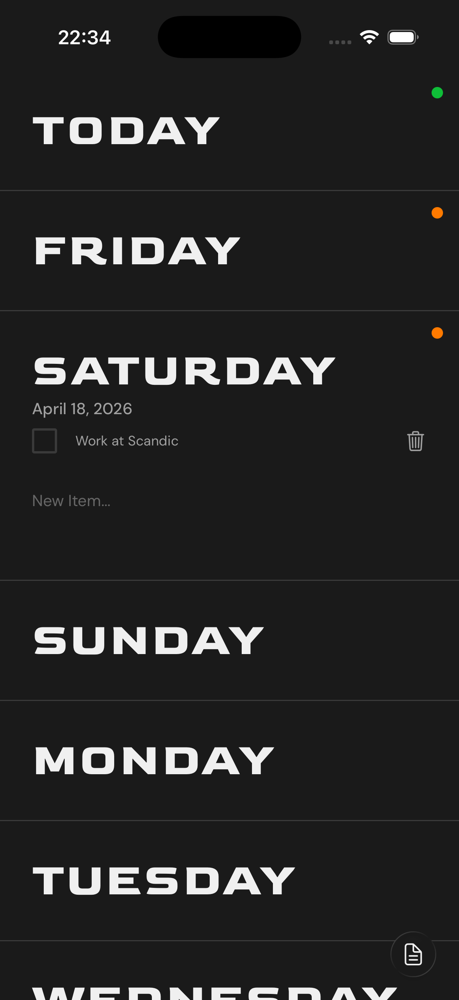
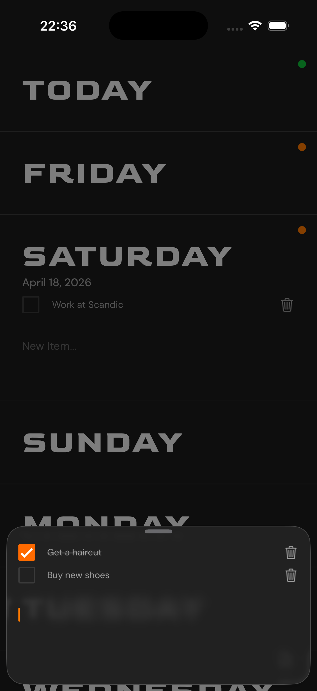

# THISWEEK

A minimal seven-day task planner. The app displays the current day and the six days ahead, each expandable to reveal tasks you want to get done that day.

**Big shoutout to:** [Notiontick](https://pin.it/5ItreBj7s) for the UI inspiration for this app!

## Web Version

Click [this link](https://thisweek.gjermundmyrvang.com) to see the web version of the app ;)

## Functionality

**7-Day Task View**  
Displays today and the next six days as an expandable list. Each day shows a colored dot indicating task status --> orange for tasks in progress, green when all tasks are completed.

**Per-Day Task Management**  
Tap any day to expand it and reveal its tasks. Add new tasks by typing in the input field and pressing done. Tasks can be checked off or deleted individually.

**Automatic Day Rolling**  
At midnight, today's date automatically rolls over to the next day. Past days and their tasks are cleaned up automatically so the view always stays current.

**Persistent Storage**  
All tasks are saved locally on the device using `AsyncStorage`. 

**Quick Notes**   
A floating action button gives quick access to a separate notes sheet for temporary items that don't belong to a specific day.

**Theming**  
Supports light and dark mode, adapting to the system appearance. On iOS 26, the UI takes advantage of Liquid Glass effects where available.

## Screenshots

**Light Theme:**

<table>
  <tr>
    <td></td>
    <td></td>
    <td></td>
    <td></td>
  </tr>
</table>

**Dark Theme:**

<table>
  <tr>
    <td></td>
    <td></td>
    <td></td>
    <td></td>
  </tr>
</table>

## Screen Recording (2x speed)

https://github.com/user-attachments/assets/8f32afd0-a5e5-45bb-a560-7fa91fb0e297

## Fonts

[Goldman Bold](https://fonts.google.com/specimen/Goldman) is used for day headings, and [DM Sans](https://fonts.google.com/specimen/DM+Sans) for all supporting text.

## Privacy Policy

The Privacy Policy for this app can be found [here](https://gjermundmyrvang.github.io/privacy_policy/nextseven/)
